# FoodApp — умный трекер калорий и правильного питания

Учебный Android-проект на Kotlin: дневник питания с вводом еды обычным текстом («сыр 100 грамм»), шкалой калорий за день, расчётом индекса массы тела и шагомером в фоне.

> Ветка `dev` содержит весь код проекта, ветка `main` служит только указателем на неё.
> Готовый APK: [Releases → v1.0](https://github.com/user3124/FoodApp/releases/tag/v1.0).

## Возможности

- **Профиль:** ввод роста и веса, мгновенный расчёт ИМТ с категорией, сохранение в локальную базу.
- **Дневник питания:** сводка калорий и БЖУ за день, оранжевая шкала прогресса, карточки приёмов пищи с раскрываемым составом.
- **ИИ-строка:** пользователь пишет, что съел, приложение распознаёт продукты и сохраняет их с БЖУ.
- **Шагомер:** фоновый счётчик шагов с постоянным уведомлением.
- **Напоминание:** раз в сутки проверяется, есть ли записи о еде за сегодня, и при их отсутствии приходит уведомление.
- Приложение работает полностью автономно: без интернета, без регистрации, без Firebase.

## Скриншоты

### Основные экраны

**Профиль (пустой)**

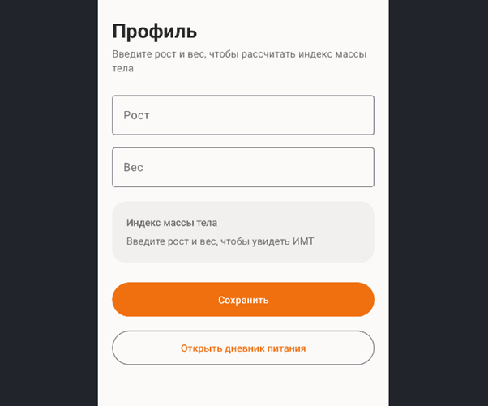

**Профиль с расчётом ИМТ**

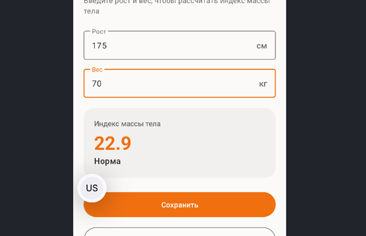

**Дневник питания**

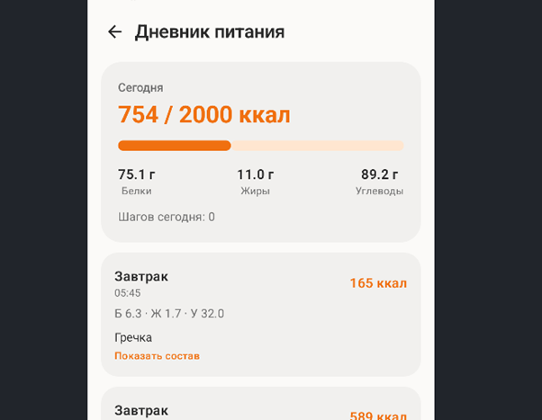

**Загрузка ИИ-строки (`CircularProgressIndicator`)**

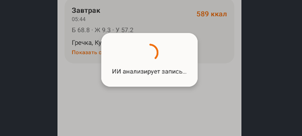

**Раскрытая карточка приёма пищи (`animateContentSize`)**

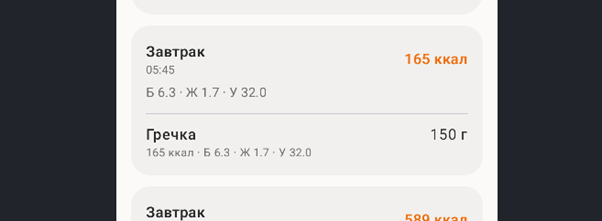

**Постоянное уведомление шагомера**

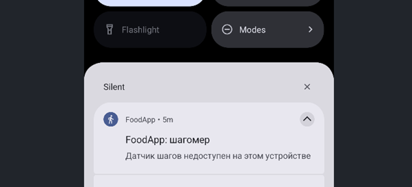

**Варианты сборки (flavors)**

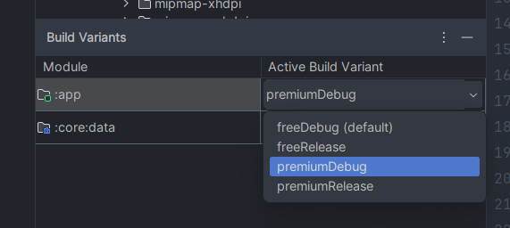

### Дополнительно

**Валидация полей профиля**

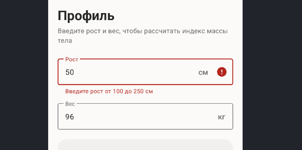

**Ошибка распознавания еды**

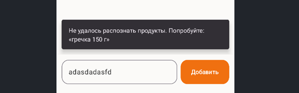

**Лимит free-версии**

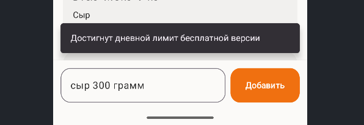

**Напоминание Worker'а**

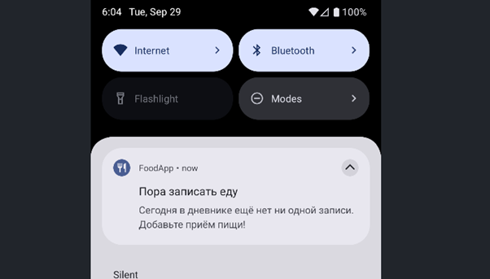

### Структура проекта и сборка

**Дерево проекта (три модуля)**

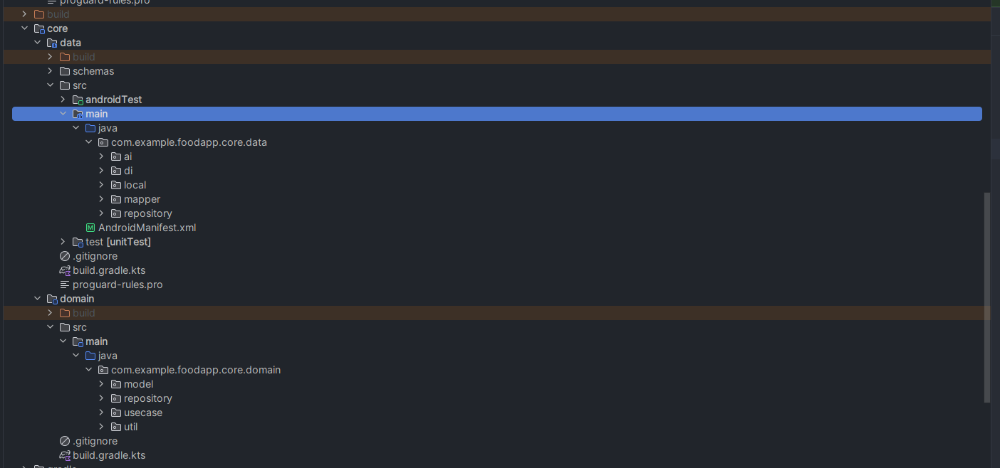

**ProGuard / R8**

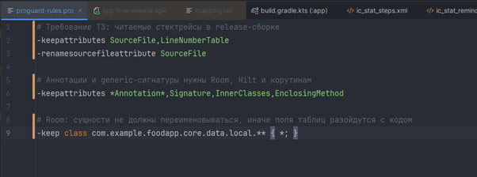

## Экраны

Приложение состоит из одной `MainActivity` и двух экранов-фрагментов:

1. **Профиль** (`ProfileFragment`, классическая XML-разметка): поля роста и веса, карточка ИМТ на Compose внутри `ComposeView`, переход в дневник.
2. **Дневник питания** (`DiaryFragment` с `ComposeView` и экраном `DiaryScreen` на Jetpack Compose): сводка дня, список приёмов пищи, поле ввода «ИИ-строки». Кнопка «Назад» возвращает на профиль.

## Технологии

| Компонент | Версия |
|---|---|
| Язык | Kotlin 2.2.20 |
| Сборка | Gradle 8.13 (Kotlin DSL), AGP 8.13.0, JDK 21 |
| UI | Jetpack Compose (BOM 2025.09.00), XML + View Binding, Material 3 |
| Compose Compiler | плагин `org.jetbrains.kotlin.plugin.compose` (версия равна версии Kotlin) |
| DI | Dagger Hilt 2.57.1 (через KSP 2.2.20-2.0.3) |
| База данных | Room 2.8.1 |
| Фоновые задачи | WorkManager 2.10.5, Foreground Service |
| SDK | minSdk 26, targetSdk / compileSdk 36 |

## Архитектура

Чистая архитектура из трёх Gradle-модулей, зависимости направлены строго внутрь:

```
:app  ───►  :core:domain  ◄───  :core:data
(UI, сервисы, Worker)   (модели, Use Cases,      (Room, репозитории,
                         интерфейсы репозиториев) Mock AI, мапперы)
```

- `:core:domain` — чистый Kotlin (JVM), без импортов `android.*`.
- Инверсия зависимостей: интерфейсы репозиториев объявлены в Domain, реализации находятся в Data и подключаются через Hilt (`@Binds`).
- Маппинг Entity и DTO в модели Domain выполняется в слое Data.

## Где в коде находится каждый критерий

Условные обозначения путей:
`APP` = `app/src/main/java/com/example/foodapp`,
`DOMAIN` = `core/domain/src/main/java/com/example/foodapp/core/domain`,
`DATA` = `core/data/src/main/java/com/example/foodapp/core/data`.

| Критерий ТЗ | Где реализовано |
|---|---|
| Kotlin, Gradle Kotlin DSL, совместимые версии | `gradle/libs.versions.toml`, `build.gradle.kts`, `app/build.gradle.kts`, `gradle/wrapper/gradle-wrapper.properties` |
| Минимум 2 модуля Gradle | `settings.gradle.kts` (`:app`, `:core:domain`, `:core:data`) |
| Domain без `android.*` | `core/domain/build.gradle.kts` (чистый `kotlin-jvm`), пакеты `DOMAIN/model`, `DOMAIN/usecase` |
| Контракты репозиториев (DIP) | `DOMAIN/repository/` (`MealRepository`, `AiRepository`, `ProfileRepository`) |
| Реализации репозиториев | `DATA/repository/`, `DATA/ai/AiRepositoryImpl.kt` |
| Use Cases | `DOMAIN/usecase/` |
| Room (сущности, DAO, БД) | `DATA/local/` (`MealEntity`, `FoodItemEntity`, `ProfileEntity`, `MealDao`, `ProfileDao`, `FoodDatabase`) |
| Маппинг DTO/Entity → Domain | `DATA/mapper/Mappers.kt`, `DATA/ai/AiFoodDto.kt` |
| Dagger Hilt | `DATA/di/DataModule.kt`, `APP/AppApplication.kt` (`@HiltAndroidApp`), `@AndroidEntryPoint` у `MainActivity` и фрагментов, `@HiltViewModel` у `APP/ui/DietViewModel.kt` |
| Foreground Service (шагомер, `Sensor.TYPE_STEP_COUNTER`, постоянное уведомление) | `APP/steps/StepCounterService.kt`, `APP/steps/StepsTracker.kt`; регистрация в `AndroidManifest.xml` (`foregroundServiceType="health"`) |
| WorkManager, `NutritionReminderWorker`, `@HiltWorker` | `APP/work/NutritionReminderWorker.kt` |
| Constraints (сеть и исправная батарея), ежесуточный запуск | `APP/work/ReminderScheduler.kt` |
| `Application` реализует `Configuration.Provider` | `APP/AppApplication.kt`; стандартный инициализатор WorkManager отключён в `AndroidManifest.xml` |
| `ProfileFragment` на XML (`LinearLayout`, `TextInputLayout`, `TextInputEditText`, View Binding) | `app/src/main/res/layout/fragment_profile.xml`, `APP/ui/profile/ProfileFragment.kt` |
| `ComposeView` внутри XML, реактивный ИМТ | `<ComposeView>` в `fragment_profile.xml`; состояние `bmi` и расчёт через `CalculateBmiUseCase` в `ProfileFragment.kt`; карточка `APP/ui/profile/BmiCard.kt` |
| `DiaryFragment` с независимым `ComposeView` и `DiaryScreen` | `APP/ui/diary/DiaryFragment.kt`, `APP/ui/diary/DiaryScreen.kt` |
| Кнопка «Назад» возвращает в профиль | `DiaryFragment.kt` (`popBackStack`), `ProfileFragment.kt` (`addToBackStack`) |
| Анимация `animateFloatAsState` (шкала калорий) | `DiaryScreen.kt`, функция `SummaryCard` |
| Анимация `animateContentSize()` (раскрытие карточек в `LazyColumn`) | `DiaryScreen.kt`, функция `MealCard` |
| «ИИ-строка», `delay(1500)`, парсинг текста, сохранение в Room | `DiaryScreen.kt` (`AiInputBar`), `AddMealFromTextUseCase`, `AiRepositoryImpl.kt` |
| `CircularProgressIndicator` (состояние загрузки) | `DiaryScreen.kt`, функция `LoadingOverlay`; флаг `isLoading` в `DietViewModel.kt` |
| `buildTypes`: debug и release с `isMinifyEnabled = true` | `app/build.gradle.kts` (блок `buildTypes`) |
| `productFlavors` `free` и `premium`, разные `applicationIdSuffix`, флаги в `BuildConfig` | `app/build.gradle.kts` (блок `productFlavors`); используется в `DietViewModel.kt` (`BuildConfig.MAX_DAILY_AI_REQUESTS`) |
| `-keepattributes SourceFile,LineNumberTable` | `app/proguard-rules.pro` |

### Flavors

| Вариант | applicationId | Дневной лимит записей |
|---|---|---|
| `free` | `com.example.foodapp.free` | 5 |
| `premium` | `com.example.foodapp.premium` | 999 |

К `applicationId` в debug-сборках добавляется `.debug`, поэтому варианты устанавливаются на устройство параллельно. В `BuildConfig` также объявлен флаг `IS_PREMIUM` (задел под дальнейшие функции).

## Mock AI Engine

Распознавание еды в этой версии выполняется **заглушкой**: `AiRepositoryImpl` имитирует сетевой запрос через `delay(1500)`, затем разбирает текст по словарю из 18 популярных продуктов (сыр, яйца, курица, гречка, рис, яблоко и другие) и пересчитывает КБЖУ на указанный вес. Настоящая нейросеть не используется, сетевых запросов нет.

Подключить реальный сервис (например, Sber GigaChat) можно без изменения UI и Domain:

1. Написать новую реализацию `AiRepository` с HTTP-клиентом и токеном доступа.
2. Заменить привязку в `DATA/di/DataModule.kt`.
3. Добавить разрешение `INTERNET` в манифест.

Ключ доступа нужно хранить вне репозитория (например, в `local.properties`).

## Примеры запросов для «ИИ-строки»

- `сыр 100 грамм`
- `2 яйца`
- `гречка 150 г, курица 200 г и яблоко`

## Хранение данных

Все данные хранятся локально в Room (`foodapp.db`):
- `meals` и `food_items` — приёмы пищи и ингредиенты;
- `profile` — рост и вес пользователя (одна строка). Сам ИМТ не сохраняется, он рассчитывается при вводе.

Число шагов за день хранится в `SharedPreferences` (`StepsTracker`).

## Сборка и запуск

Требования: Android Studio с JDK 21.

```bash
# debug-сборка
./gradlew :app:assembleFreeDebug

# release-сборка (R8 включён)
./gradlew :app:assembleFreeRelease
```

APK: `app/build/outputs/apk/free/release/app-free-release.apk`.
В Android Studio выберите нужный вариант в `View → Tool Windows → Build Variants` и нажмите Run.

Готовый APK можно скачать в разделе [Releases](https://github.com/user3124/FoodApp/releases/tag/v1.0). Release-сборка подписана debug-ключом (учебный проект), Play Protect может показать предупреждение.

## Разрешения

- `ACTIVITY_RECOGNITION` — доступ к датчику шагов.
- `POST_NOTIFICATIONS` — уведомления шагомера и напоминания (Android 13+).
- `FOREGROUND_SERVICE`, `FOREGROUND_SERVICE_HEALTH` — фоновый шагомер.

## Известные ограничения

- Датчика шагов может не быть в эмуляторе. Тогда в уведомлении будет надпись «Датчик шагов недоступен».
- Норма калорий фиксирована (2000 ккал) и пока не зависит от профиля.
- Нет авторизации и облачной синхронизации: приложение однопользовательское и локальное.
- Распознавание еды выполняет заглушка с ограниченным словарём.